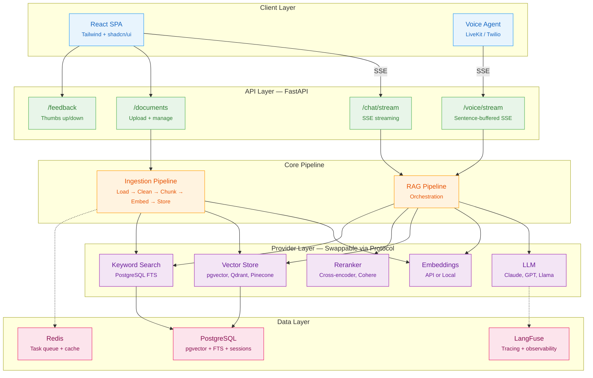
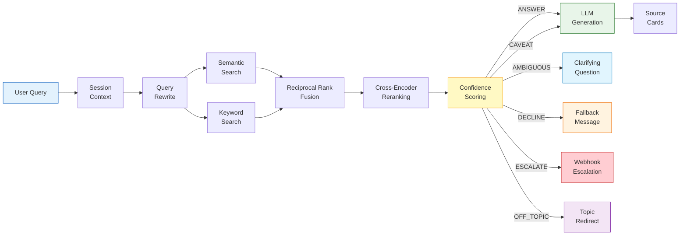
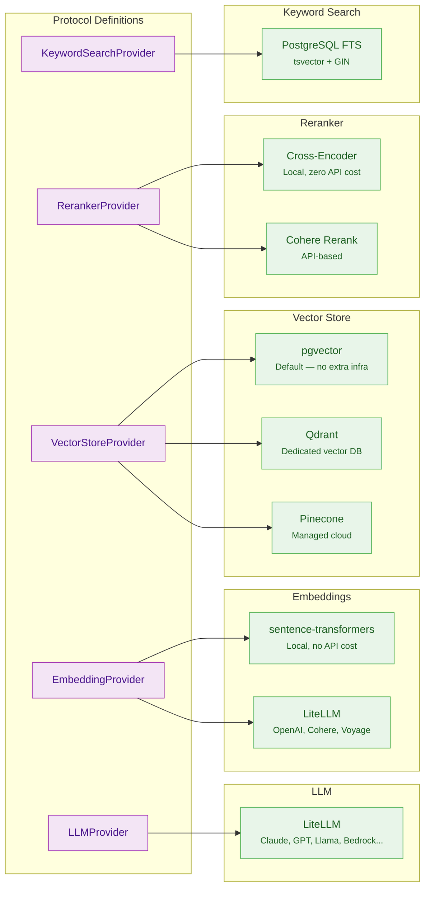
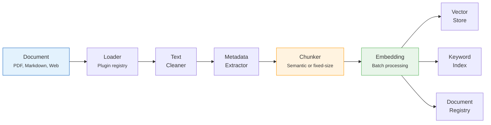
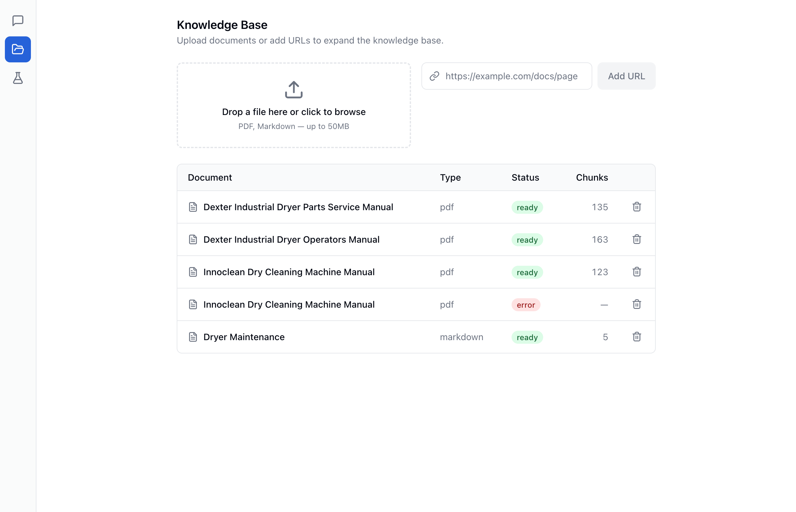
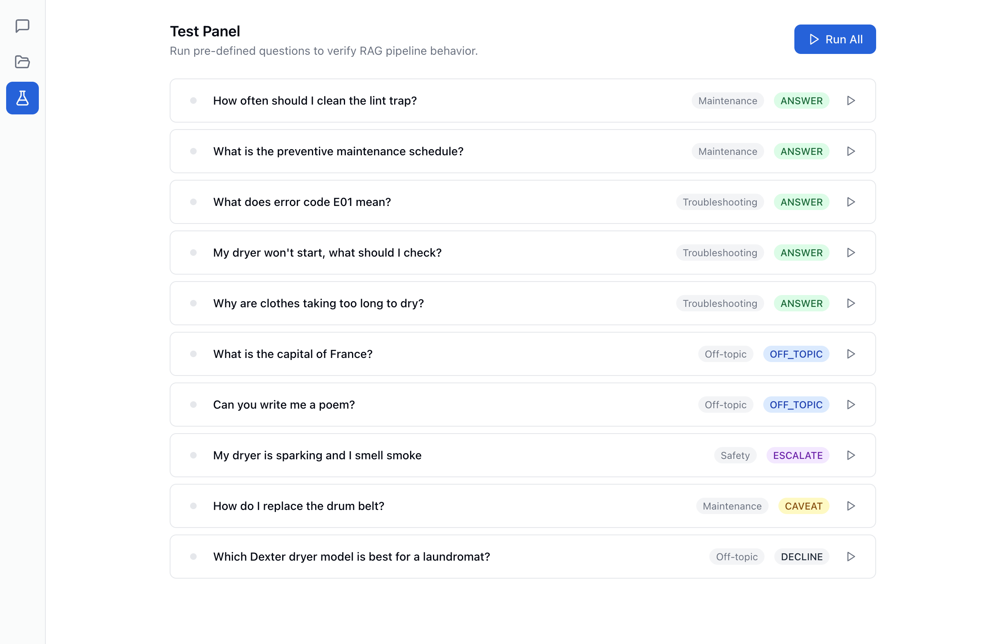
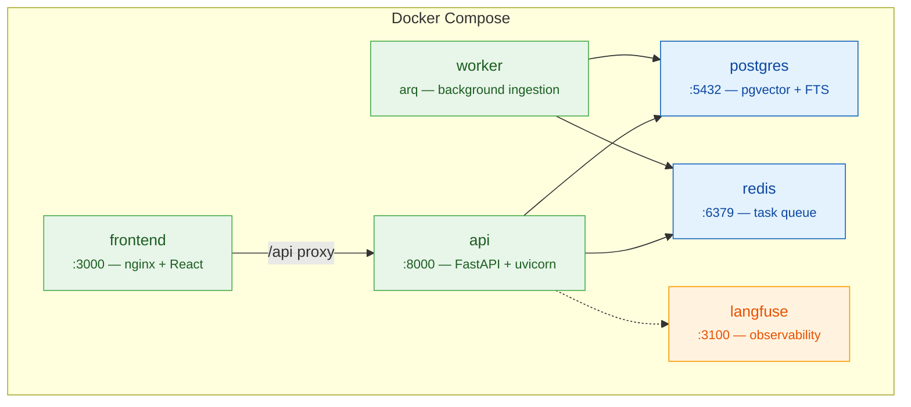

# Tech Support

<p align="center">
  
  
  
  
</p>

Production RAG framework for technical customer support. Ingests documentation (PDF, markdown, web), answers questions grounded exclusively in that documentation, and escalates to humans when it can't. Built as a deployable framework — one codebase serves multiple products and organizations via configuration.

---

## Design Principles

**Protocol-driven provider abstraction.** Every external dependency — LLM, embeddings, vector store, reranker, keyword search — is accessed through a Python `Protocol` (structural subtyping, no base class inheritance). Implementations are fully decoupled from the pipeline that consumes them. Switching from pgvector to Qdrant, or from a local cross-encoder to Cohere Rerank, is a config change. The core pipeline code never imports a concrete provider.

**Configuration over code.** Deployment-specific behavior lives in config, not source. Two layers: environment variables (secrets, infrastructure) via `pydantic-settings`, and YAML files (retrieval tuning, confidence thresholds, persona templates). A new deployment means a new config directory, not a fork.

**Modular pipeline stages.** The RAG pipeline is a sequence of discrete, independently testable stages — query rewrite, semantic search, keyword search, fusion, reranking, confidence scoring, generation. Each stage has a clear input/output contract. Stages can be skipped, replaced, or reordered without touching adjacent code.

**Plugin-based ingestion.** Document loaders, chunking strategies, and text processors are registered via a plugin pattern. Adding a new document format means implementing one protocol method and registering it — the ingestion orchestrator handles sequencing, error handling, and storage.

**Design for the next requirement.** Single-tenant now, but every table is ready for `tenant_id` + Row-Level Security. Session-based conversation now, but the session manager interface supports persistent memory. Chat-first, but the streaming API is structured for voice consumption (sentence-buffered SSE). The architecture accommodates these without refactoring — they're migrations, not rewrites.

**Fail safe, not fail silent.** The system prefers "I don't know" over hallucination. Confidence-tiered routing means the LLM is only invoked when retrieval quality is high. Low-confidence, ambiguous, off-topic, and escalation paths are all handled with deterministic responses — no generation, no risk. The pipeline is fully traced through LangFuse, and user feedback creates a continuous quality signal.

---

## Architecture



---

## RAG Pipeline

Query flow from input to response:



### How It Works

1. **Session context** — Loads recent conversation history for multi-turn understanding
2. **Query rewrite** — LLM condenses multi-turn context into a standalone search query
3. **Parallel retrieval** — Runs semantic search (vector similarity) and keyword search (PostgreSQL full-text) simultaneously
4. **Reciprocal Rank Fusion** — Merges both result sets, weighting results that appear in both lists higher
5. **Cross-encoder reranking** — A dedicated model reads each (query, passage) pair and scores true relevance, not just surface similarity
6. **Confidence scoring** — Classifies the response into one of six tiers based on the top reranker score, score distribution, and topic diversity
7. **Tier routing** — Only high-confidence queries reach the LLM. Everything else gets handled without generation

### Confidence Tiers

Response behavior is determined by confidence tier:

| Tier | Condition | System Behavior |
|:---|:---|:---|
| **ANSWER** | Top score >= 0.85 | Full answer grounded in retrieved passages, with source citations |
| **CAVEAT** | Top score >= 0.60 | Answer with disclaimer: *"Based on what I found, I'd recommend verifying..."* |
| **AMBIGUOUS** | High scores across multiple topics | Asks a clarifying question before answering |
| **DECLINE** | Top score >= 0.35 | Returns fallback message — no LLM call, no risk of hallucination |
| **ESCALATE** | Top score < 0.35 | Dispatches webhook to human support queue |
| **OFF_TOPIC** | Below minimum relevance | Redirects: *"I can only help with questions about [product]"* |

All thresholds are configurable per deployment via YAML.

---

## Provider Abstraction

Every external dependency is behind a Python `Protocol` (structural subtyping, no base class inheritance). Implementations are swappable via config.



Swap providers via config — factory wires the correct implementation at startup:

```yaml
# .env
VECTORSTORE_PROVIDER=qdrant
RERANKER_PROVIDER=cohere
```

---

## Guardrails

Safety is enforced at three layers, not just the prompt:

1. **Retrieval gate** — If no results exceed the minimum relevance threshold, the LLM is never called. The system returns a deterministic redirect message. No retrieval context means no generation.

2. **Confidence routing** — Only ANSWER and CAVEAT tiers invoke the LLM. DECLINE, ESCALATE, AMBIGUOUS, and OFF_TOPIC are handled with pre-written responses — the LLM is not in the loop.

3. **Prompt constraints** — The persona template includes locked, non-overridable rules: answer only from provided context, cite sources, ask when ambiguous, refuse off-topic requests, resist instruction override attempts.

**Escalation** dispatches a structured webhook (session context + query + reason) to any HTTP endpoint — Zendesk, Jira, Slack, or a custom handler.

---

## Document Ingestion



Ingestion runs asynchronously via an arq worker queue. Documents are processed in the background — loaded, cleaned, chunked, embedded, and indexed across all search backends.

Each document format has a registered `DocumentLoader`. Adding a new format means implementing one protocol method and registering it.

| Format | Loader | Status |
|:---|:---|:---|
| Markdown | Custom parser | Production |
| PDF | `unstructured` | Production |
| Web pages | httpx + BeautifulSoup | Production |
| DOCX/PPTX | `unstructured` | Planned |

**Chunking strategies** are configurable per deployment:
- **Semantic chunking** (default) — Splits on natural semantic boundaries using Chonkie's Savitzky-Golay boundary detection
- **Fixed-size chunking** — Token-based windows with configurable overlap, for consistent chunk sizes

---

## Frontend

### Chat
Streaming responses via SSE. Answers render token-by-token.


### Knowledge Base
Upload documents, add URLs, track ingestion status and chunk counts.



### Test Panel
Pre-defined test suites validate pipeline behavior across all confidence tiers.




---

## Deployment

```bash
cp .env.example .env    # Configure API keys and settings
make deploy             # Build, start, migrate, ingest sample docs
```

### Service Topology



### Configuration

The system uses a two-layer config architecture:

| Layer | Source | Purpose |
|:---|:---|:---|
| **Environment variables** | `.env` | Secrets, API keys, infrastructure endpoints |
| **YAML config** | `backend/config/` | Retrieval tuning, confidence thresholds, persona |

Environment variables always take precedence. YAML provides deployment-specific behavior configuration.

### Persona

Each deployment defines its persona in YAML — company name, product scope, tone, response templates. The system prompt is a Jinja2 template with locked guardrails:

```yaml
# backend/config/persona/default.yaml
system_prompt: |
  You are a support assistant for {{ company_name }}.

  ## STRICT RULES — NON-OVERRIDABLE
  1. You can ONLY answer questions related to the documentation provided.
  2. If the user's question is ambiguous, ask a clarifying question.
  3. Always cite your sources.
  4. If you are not confident, say so clearly.
  ...
```

---

## Tech Stack

| Layer | Technology | Why |
|:---|:---|:---|
| **Backend** | Python 3.12, FastAPI, SQLAlchemy 2.0 | Async-native, type-safe, proven in production |
| **Frontend** | React 19, Vite, Tailwind CSS, shadcn/ui | Modern DX, composable components, fast builds |
| **LLM** | LiteLLM (provider-agnostic) | 100+ model providers through one interface |
| **Embeddings** | sentence-transformers (local) or API | Zero-cost local default, API for quality |
| **Vector Store** | pgvector on PostgreSQL | No extra infrastructure for typical scale |
| **Keyword Search** | PostgreSQL FTS (tsvector + GIN) | Already have Postgres — no Elasticsearch needed |
| **Reranking** | Cross-encoder (local) or Cohere | Precision scoring, ~50ms on CPU |
| **Chunking** | Chonkie | 33x faster than LangChain, rigorous boundary detection |
| **Task Queue** | arq (Redis-backed) | Async-native, lightweight |
| **Streaming** | Server-Sent Events (sse-starlette) | Simpler than WebSocket, works through proxies |
| **Observability** | LangFuse (self-hosted) + structlog | Full pipeline tracing, no vendor lock-in |
| **CI** | GitHub Actions | Lint + type check + test + build on every PR |

---

## Extension Points

- **New document format** — Implement `DocumentLoader` protocol, register it. Pipeline handles the rest.
- **Swap provider** — Change one env var. pgvector to Qdrant, local embeddings to OpenAI, cross-encoder to Cohere.
- **Per-deployment config** — Company, product, tone, thresholds, escalation targets — all YAML. One codebase, many deployments.
- **Voice interface** — `/voice/stream` buffers tokens into complete sentences for TTS consumption (LiveKit, Twilio, etc.).
- **Multi-tenant** — Schema is designed for `tenant_id` + Row-Level Security. Provider interfaces already accept filter parameters.

---

## Development

### Prerequisites

- Python 3.12+
- Node.js 22+
- Docker & Docker Compose
- [uv](https://docs.astral.sh/uv/) package manager

### Quick Start

```bash
# Clone and install
git clone <repo-url> && cd customer-service-bot
make install

# Start infrastructure (Postgres, Redis, LangFuse)
make dev-up

# Run database migrations
make migrate

# In separate terminals:
make dev-api          # API server on :8000
make dev-worker       # Background worker
make dev-frontend     # Frontend on :5173

# Ingest sample documentation
cd backend && uv run python scripts/ingest_sample_docs.py
```

### Commands

```
make install          Install all dependencies (backend + frontend)
make dev              Start full dev stack (infra + API + worker)
make dev-up           Start Postgres, Redis, LangFuse containers
make dev-api          FastAPI with hot reload on :8000
make dev-worker       arq background worker
make dev-frontend     Vite dev server on :5173
make migrate          Run Alembic database migrations
make test             Run all tests
make test-unit        Unit tests only
make test-cov         Tests with HTML coverage report
make lint             Ruff check + format check
make format           Auto-fix lint + format issues
make deploy           Full production deploy via Docker Compose
```

---

## API Reference

### Chat

| Method | Endpoint | Description |
|:---|:---|:---|
| `POST` | `/api/v1/chat/stream` | Send message, receive SSE stream |

**SSE Event Protocol:**

```
event: metadata    → {session_id, confidence_tier, message_id}
event: delta       → {content: "token..."}     (repeated)
event: sources     → [{title, text, score}]
event: done        → {usage: {...}}
```

### Sessions

| Method | Endpoint | Description |
|:---|:---|:---|
| `POST` | `/api/v1/sessions` | Create new chat session |
| `GET` | `/api/v1/sessions` | List sessions |
| `GET` | `/api/v1/sessions/:id` | Get session with messages |
| `DELETE` | `/api/v1/sessions/:id` | End session |

### Documents

| Method | Endpoint | Description |
|:---|:---|:---|
| `POST` | `/api/v1/documents/upload` | Upload file (PDF, Markdown) |
| `POST` | `/api/v1/documents` | Submit URL for ingestion |
| `GET` | `/api/v1/documents` | List all documents |
| `GET` | `/api/v1/documents/:id/status` | Check ingestion status |
| `DELETE` | `/api/v1/documents/:id` | Remove document + chunks |

### Feedback & Observability

| Method | Endpoint | Description |
|:---|:---|:---|
| `POST` | `/api/v1/feedback` | Submit thumbs up/down on a response |
| `GET` | `/api/v1/health` | Health check |
| `GET` | `/api/v1/ready` | Readiness probe (checks DB connectivity) |

---

## Project Structure

```
customer-service-bot/
├── backend/
│   ├── app/
│   │   ├── api/v1/             # HTTP endpoints (chat, docs, feedback, voice, admin)
│   │   ├── core/               # Config, logging, exceptions
│   │   ├── db/                 # Async engine, repositories
│   │   ├── ingestion/          # Loaders, chunkers, processors
│   │   ├── middleware/         # API key auth (timing-safe)
│   │   ├── models/             # SQLAlchemy ORM (documents, sessions, feedback)
│   │   ├── providers/          # Protocol definitions + implementations
│   │   ├── schemas/            # Pydantic request/response models
│   │   ├── services/           # RAG pipeline, confidence, persona, escalation
│   │   └── workers/            # arq background ingestion
│   ├── config/                 # YAML config (retrieval, persona)
│   ├── tests/                  # Unit + integration tests
│   └── alembic/                # Database migrations
├── frontend/
│   ├── src/
│   │   ├── components/chat/    # ChatWindow, MessageBubble, SourceCard, FeedbackButtons
│   │   ├── components/resources/   # UploadDropzone, DocumentList
│   │   ├── hooks/              # useChat (SSE), useSession, useDocuments
│   │   ├── lib/                # API client, SSE streaming
│   │   └── pages/              # Chat, Resources, Test
│   └── nginx.conf              # Production reverse proxy
├── docker-compose.yml          # Full stack definition
├── Makefile                    # Development and deployment commands
└── .github/workflows/ci.yml   # Lint, test, build on every PR
```

---

<p align="center">
  <em>Built by <a href="https://github.com/sophia-systems">Sophia Systems</a></em>
</p>
